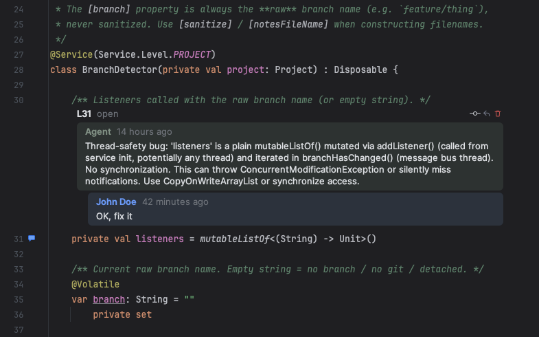
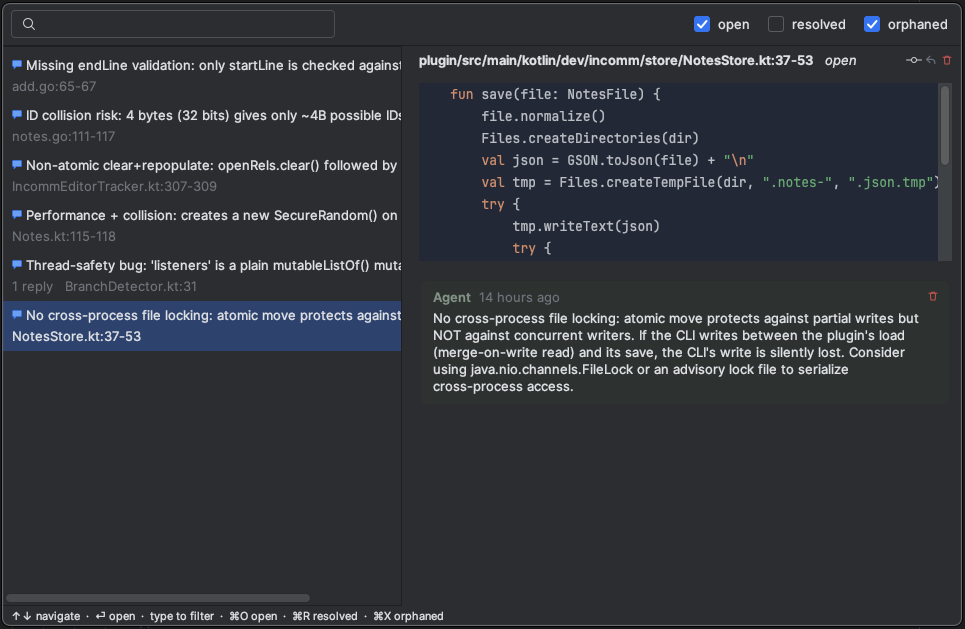

# incomm

**Line-anchored context threads for humans and AI agents.**

`incomm` lets you attach threaded notes to exact lines and ranges in a codebase, then share those notes through a small branch-scoped JSON state file. Humans can leave review feedback, TODOs, questions, implementation hints, or missing context directly next to the relevant code. Agents can read that distributed context through the CLI, act on it, reply to threads, resolve them, or leave their own line-anchored observations for the human or a future agent pass.




---

## Table of Contents

- [What is incomm?](#what-is-incomm)
- [Features](#features)
- [Installation](#installation)
  - [IntelliJ Plugin](#intellij-plugin)
  - [CLI](#cli)
- [Quick Start](#quick-start)
- [Why incomm?](#why-incomm)
- [Internals & Architecture](#internals--architecture)

---

## What is incomm?

Think of `incomm` as **distributed prompting across multiple files**: instead of packing every instruction into one massive chat message or prompt, you can place precise, file-local prompts where they belong and let an agent process them programmatically.

It also works incredibly well for **local code review** or collaborating on large feature branches, keeping the conversation attached to the code itself rather than floating in a pull request UI that might be out of sync with your local state.

The on-disk format and CLI are intentionally **editor/IDE agnostic**. At the moment, the only supported editor integration in this repository is the IntelliJ/JetBrains plugin, but other editor integrations (VS Code, Neovim, etc.) can implement the same shared specification.

## Features

- **Branch-scoped state**: Notes are stored in `<project-root>/.incomm/notes_<branch>.json`. When you switch git branches, the conversation switches with it.
- **Robust Anchoring**: Comments stay attached to the right line even as files change (using best-effort text anchors, prefixes, context, and checksums). The IntelliJ plugin updates these positions live as you type.
- **Concurrent-safe**: The file format is designed for atomic writes. The CLI and the IDE can safely write to the same file concurrently without clobbering each other.
- **Cross-environment**: Agents (like Opus or GPT) can interact natively using the standalone CLI, completely decoupling them from whatever IDE you are using.
- **Agnostic & Lightweight**: No backend databases, no web services. Just a small JSON file committed or ignored in your repo.

---

## Installation

The project consists of two independent components: the CLI (for agents and scripting) and the IntelliJ plugin (for human interaction).

### IntelliJ Plugin

The plugin gives you a rich UI to add, reply to, and resolve comments directly inside the IDE.

*Currently preparing for the JetBrains Plugin Registry release.*

**Manual Build:**
1. Clone this repository.
2. Build the plugin zip:
   ```bash
   cd plugins/intellij
   export JAVA_HOME=$(/usr/libexec/java_home -v 21) # Requires JDK 21
   ./gradlew buildPlugin
   ```
3. Install the generated ZIP (`plugins/intellij/build/distributions/incomm-*.zip`) in IntelliJ via **Settings | Plugins | ⚙️ | Install Plugin from Disk...**

### CLI

The Go CLI is the workhorse for agents and automated workflows.

*Currently preparing for Homebrew release.*

**Manual Build:**
1. Install Go.
2. Build and install:
   ```bash
   cd cli
   go install .
   ```
   *Make sure `$(go env GOPATH)/bin` is in your `$PATH`.*

---

## Quick Start

### For Humans (IntelliJ)

1. Open a project in IntelliJ with the `incomm` plugin installed.
2. Right-click the gutter next to any line of code and select **Incomm: Start New Thread** (or bind a shortcut in Keymap).
3. Type your note (e.g., *"Agent: Please refactor this to use the new caching service."*).
4. Save. A `.incomm/` folder will be created at your project root.

### For Agents (CLI)

Agents landing in a repository with `.incomm` should start by reading the built-in skill instructions:

```bash
incomm skill path            # writes ~/.config/.incomm/SKILL.md, prints its absolute path
```

Once loaded, the agent can use the CLI to interact with the human's requests:

```bash
# 1. Read unresolved notes
incomm list --unresolved --json

# 2. View full context of a specific thread
incomm show <id> --json

# 3. Add a reply or mark it resolved after doing the work
incomm reply <id> -c "Fixed: refactored to use the caching service."
incomm resolve <id>
```

---

## Why incomm?

Traditional code review tools (like GitHub PRs) are fantastic for merging code, but they struggle when you want to:
- Leave notes for yourself during a heavy refactoring session.
- Delegate 15 small context-specific tasks to an AI agent across 10 different files.
- Discuss implementation details with a colleague *before* you open a PR.

`incomm` bridges this gap by bringing the conversation down to the filesystem level, making it accessible to any tool, agent, or IDE that can read and write JSON.

---

## Internals & Architecture

If you are looking to contribute to `incomm`, build a new editor integration (like VS Code or Neovim), or want to understand the exact JSON schema and anchoring algorithm, please see [AGENTS.md](AGENTS.md).
